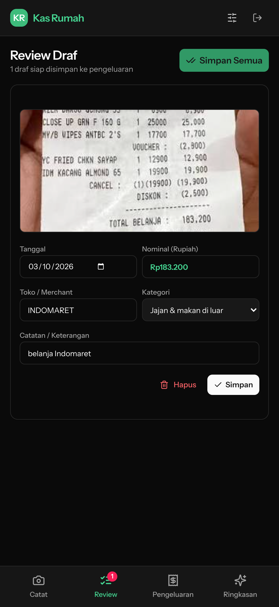
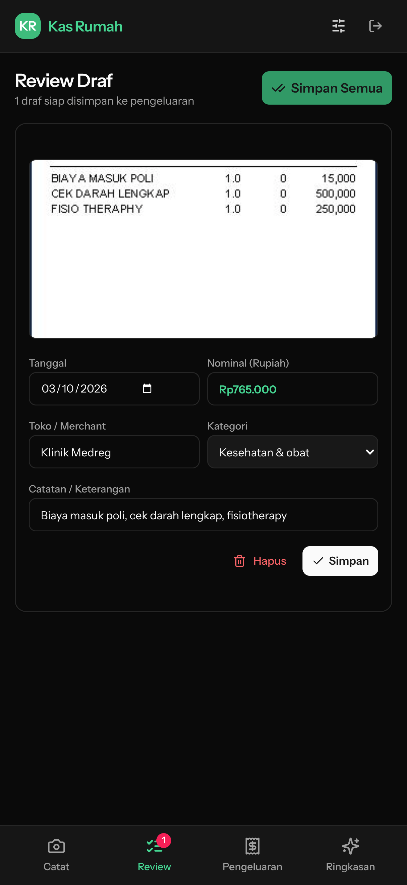
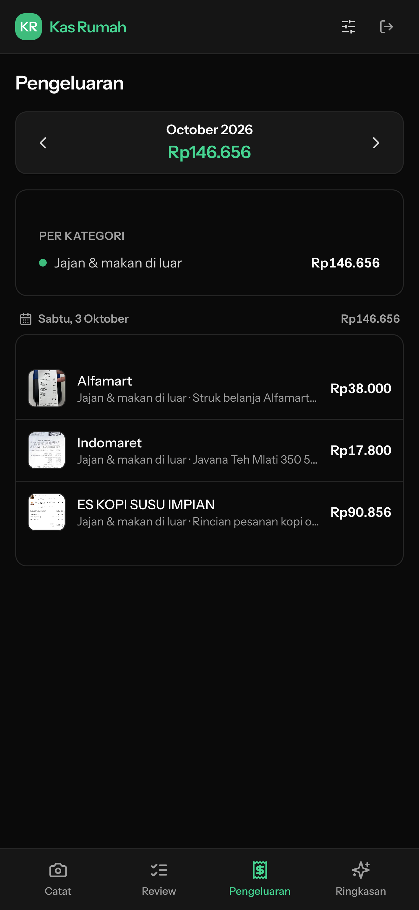
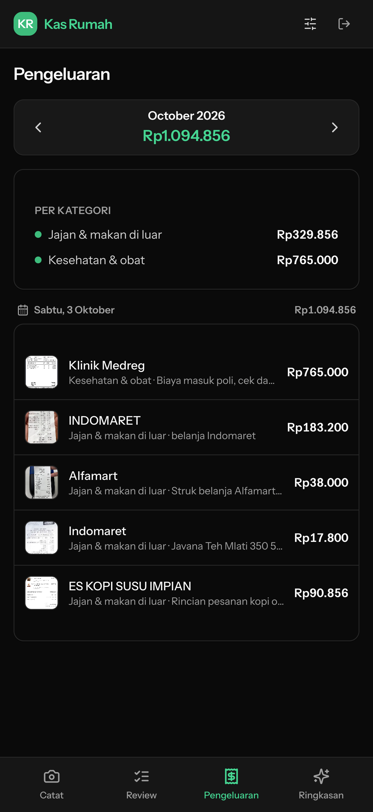
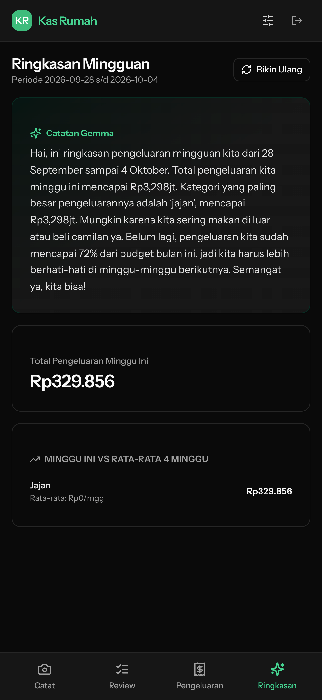

# Kas Rumah

A household expense tracker for a spouse managing the family's budget. Snap a photo of a receipt or bank transfer screenshot, or type a casual note like "beli sayur 45rb" — a **local Gemma 3 model via Ollama** parses it into a categorized expense. Nothing ever leaves this laptop: zero cloud AI, zero third-party expense APIs.

## Stack

- Laravel 13 + Inertia (React, TypeScript) with the official starter kit
- SQLite or MySQL database
- Ollama running `gemma3:4b` (vision-capable) at `http://127.0.0.1:11434`
- Money is stored as **integer rupiah** (no decimals)
- UI copy is casual Indonesian; code, comments, and commit messages are English

## Screenshots

Live captures from the app running on an **iPhone 16 Pro Max** (dark mode, Safari over local Wi‑Fi).

### 1. Review Drafts (Gemma Extracted Struk)
Gemma parses the receipt photo, downscales it locally, and presents an inline-editable draft. Thumbnails are served via an auth-checked route.

<p align="center">
  
  &nbsp;&nbsp;&nbsp;&nbsp;
  
</p>

### 2. Pengeluaran (Monthly Grouped Expenses)
Confirmed receipts grouped by date with per-category breakdown and quick month switcher.

<p align="center">
  
  &nbsp;&nbsp;&nbsp;&nbsp;
  
</p>

### 3. Ringkasan (Weekly AI Narrative & Budget Usage)
Gemma crafts a casual weekly summary in friendly Indonesian. Facts, totals, and budget percentage bars are computed deterministically in PHP before reaching the model.

<p align="center">
  
</p>

---

## One-time Setup

```bash
composer install
npm install
cp .env.example .env
php artisan key:generate
php artisan migrate
```

Make sure Ollama is installed and the model is downloaded:

```bash
ollama pull gemma3:4b   # ~3.3 GB
ollama serve
```

Optional overrides in `.env`:

```dotenv
OLLAMA_URL=http://127.0.0.1:11434
OLLAMA_MODEL=gemma3:4b
```

## Development

```bash
composer run dev   # sail-style: vite + queue + pail + server in one command
```

## The 5 Pages

| Page | Route | Purpose |
|---|---|---|
| **Catat** | `/` | Camera button (`capture="environment"`), photo library picker, or free-text input. Helper text reminds the user the iPhone's mic key works for dictation (our voice input). |
| **Review** | `/review` | Inline-editable drafts (date, merchant, description, amount, category). Receipt thumbnails shown; low-confidence rows highlighted. Per-row **Simpan** / **Hapus** plus **Simpan Semua**. |
| **Pengeluaran** | `/expenses` | Confirmed expenses grouped by date for a selected month, with month total and per-category totals. Month switcher. |
| **Ringkasan** | `/summary` | Gemma-written weekly paragraph plus facts: this week vs 4-week average, budget usage bars. **Bikin Ulang** button forces regeneration. |
| **Budget** | `/budgets` | One number input per category for a monthly limit; empty means no budget. |

A fixed bottom tab bar (Catat · Review with draft count badge · Pengeluaran · Ringkasan) spans all mobile pages; Budget lives behind a header icon.

## How Extraction Works

1. A photo is downscaled by GD to ≤1600px JPEG before being sent.
2. `ExpenseExtractor` posts to Ollama with a **JSON schema** (`format` parameter), forcing structured output.
3. The one most confident row is kept; `raw_extraction` is stored on the expense row for debugging.
4. The result lands as a **draft** — auto-routing to Review — where the user confirms or edits before it becomes a real entry.

## Testing & Regression

```bash
php artisan test --compact        # or vendor/bin/pest — 47 tests, Http::fake() for Ollama
```

Extraction regression (does not touch production data):

```bash
php artisan kas:test-extract                        # all fixtures, single pass
php artisan kas:test-extract --set=tuning --runs=3  # consensus over 3 runs
php artisan kas:test-extract --set=all --model=gemma3:4b
```

Fixture layout: `tests/fixtures/extraction/{tuning,holdout}/` each with their own `expected.json`. Sensitive images (medicine receipt, bank balance) are **never committed** — they are ignored via `tests/fixtures/extraction/.gitignore` and the command reports "missing, skipped" for them.

Each case is evaluated on:
- `amount` must be **exactly** equal to the ground truth
- `category` must be **exactly** equal
- `merchant` is checked case-insensitively via `str_contains`

## Run on Your Phone

The app runs on the laptop; the iPhone reaches it over the same Wi‑Fi network.

1. Build assets **once** (so the phone does not need the Vite dev server):

   ```bash
   npm run build
   ```

2. Start Ollama:

   ```bash
   ollama serve
   ```

3. Serve the app to all network interfaces:

   ```bash
   php artisan serve --host=0.0.0.0 --port=8000
   ```

4. Find your laptop's LAN IP:

   ```bash
   ipconfig getifaddr en0
   ```

5. On iPhone Safari, open:

   ```
   http://YOUR_LAPTOP_IP:8000
   ```

6. Log in, then **Add to Home Screen** for a native-looking experience.

Notes:
- Camera access over plain `http://` on LAN works. The `accept="image/jpeg,image/png"` attribute makes iOS Safari auto-convert HEIC to JPEG before upload — no server-side HEIC handling needed.
- If a receipt fails to parse, confirm `ollama ps` shows `gemma3:4b` is loaded.
- If connection to port `11434` is refused, start it with `ollama serve`.

## Honest Metrics

Full per-phase reports live in [`docs/`](./docs/):

| Artifact | Result |
|---|---|
| `docs/PHASE_1_RESULTS.md` | 3 photos + 4 text samples: amounts & categories reliable |
| `docs/PHASE_2_RESULTS.md` | 5-page UI shipped, tests pass — but image prompt had test answers |
| `docs/PHASE_2.1_RESULTS.md` | **Leak-free prompt**: tuning images 1/3, text 4/4, holdout 0/2 |

The Phase 2.1 numbers on `gemma3:4b` (Apple M5, 16 GB) reveal the true difficulty of receipt OCR when no test answers leak into the prompt.

## Known Limitations

- Stylized or rotated logos (e.g. minimarket signage) often get read as `null` merchant — fill it in during Review.
- Very blurry handwriting or compressed photos may drop a digit on `amount`; the low-confidence highlight (threshold `0.7`) helps catch them.
- `.HEIC` files are unsupported locally (Ollama vision); iOS Safari silently converts before upload.

---

## Credits

Built during the DEV Hacktoberfest Weekend Challenge ("Build for a Friend"). No cloud AI APIs are used — everything runs locally on this machine.